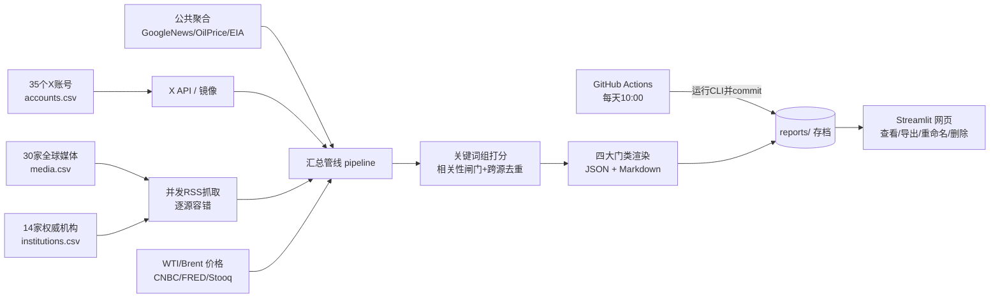

# 原油观察日报（oil-watch）

聚合 **X(Twitter) 关注账号 + 全球 30 家主流媒体 + 14 家权威机构 + 公共聚合信源**，自动筛选其中可能影响**原油价格**的全部信息——能源市场、战争与地缘、宏观经济、政治政策四大门类——每天 **10:00（默认北京时间，可改）** 形成分类报告并长期存档；网页端支持查看、**导出到本地、重命名、删除**。通过 GitHub Actions 部署到 Streamlit Community Cloud。

## 信源与门类

| 信源层 | 数量 | 是否需要 Key | 内容 |
|---|---|---|---|
| X 关注账号 | 35（`data/accounts.csv`） | 需要 X_BEARER_TOKEN（或镜像） | 能源交易员、油轮追踪、宏观与地缘一线账号 |
| 全球 Top30 媒体 | 30 启用 + 15 备选（`data/media.csv`） | 否，免费 RSS | BBC/NYT/CNN/卫报/AP/华盛顿邮报/路透/半岛电视台/彭博/CNBC/FT/WSJ/经济学人/NPR/Politico/The Hill/Axios/今日美国/Fox/NBC/DW/France24/NHK/日经/Sky/电讯报/CBC/ABC澳/印度时报/SCMP |
| 权威机构 | 14（`data/institutions.csv`） | 否 | OPEC、IEA、EIA、IMF、世界银行、美联储、欧央行、日本央行、白宫、国务院、财政部、北约、IAEA、欧盟委员会 |
| 公共聚合骨干 | 6 个主题查询 | 否 | Google News 多语种主题检索 + OilPrice + EIA（全球可达的兜底层） |
| 价格 | WTI / Brent | 否 | CNBC 期货实时 → FRED 现货 → Stooq 三级兜底 |

媒体/机构完整清单见 `data/媒体机构列表.md`。媒体排序参考 Press Gazette 基于 Similarweb 的全球新闻品牌月榜，并兼顾地缘覆盖平衡。

**四大门类（报告按此分节）**

- **A 能源市场**：核心油价、供需产量、库存炼厂、需求消费、航运油轮、天然气与成品油
- **B 战争与地缘**：战争冲突、制裁与地缘博弈
- **C 宏观经济**：央行、美元、通胀、衰退、金融市场
- **D 政治政策**：选举、政府、外交、能源政策（仅在同时命中油价直接相关组时才入选，纯政治噪音自动剔除）

## 架构与数据流



- **定时生成**：GitHub Actions（`.github/workflows/daily_report.yml`），cron `0 2 * * *` UTC = **北京时间 10:00**，生成后自动 commit 回仓库，报告长期不丢。
- **逐源容错**：任何一个媒体/机构 RSS 失败只记录状态、不影响整体；报告末尾「抓取源状态」列出可用率与失败原因。
- **X 三级链路**：官方/网关 Bearer Token → Nitter/RSSHub 镜像（可选）→ 跳过 X 仅用媒体机构；任何一级不可用都不中断出报告。配置见 `X_TOKEN配置指南.md`。

## 目录结构

```
oil-watch/
├── app.py                     # Streamlit 前端（部署入口，5个Tab）
├── requirements.txt
├── data/
│   ├── accounts.csv           # 35个X账号主清单
│   ├── media.csv              # 30家top媒体 + 15家备选（enabled 开关）
│   ├── institutions.csv       # 14家权威机构（含Google News站内备份）
│   ├── 账号列表.md / 媒体机构列表.md
│   └── x_user_ids.json        # X handle->uid 缓存（省API费用，自动生成）
├── oilwatch/                  # 核心包
│   ├── config.py              # .env 自动加载/环境变量统一入口
│   ├── accounts.py            # X 账号读取/新增
│   ├── keywords.py            # 10个关键词组 → 4大门类
│   ├── filter.py              # 相关性打分与市场闸门
│   ├── prices.py              # WTI/Brent 价格（三级兜底，免key）
│   ├── pipeline.py            # 多源编排（五类来源可独立开关）
│   ├── report.py              # 四大门类 Markdown 渲染
│   ├── storage.py             # 存档/重命名/删除/导出ZIP
│   ├── cli.py                 # 命令行入口（daily/check-token/accounts/sources/list）
│   └── sources/
│       ├── x_api.py           # X API v2（支持网关、ID持久缓存）
│       ├── twitter_mirror.py  # Nitter/RSSHub 免Token镜像
│       ├── media_feeds.py     # 媒体/机构 CSV 读取与并发抓取
│       └── public_feeds.py    # Google News/OilPrice/EIA 聚合骨干
├── reports/                   # 报告存档（.json + .md 成对）
├── .github/workflows/daily_report.yml
└── tests/                     # 16 个单元测试
```

## 一、本地运行

```bash
cd oil-watch
python -m venv .venv && source .venv/bin/activate   # Windows: .venv\Scripts\activate
pip install -r requirements.txt
python -m oilwatch.cli daily          # 生成日报到 reports/（媒体/机构无需任何key）
python -m oilwatch.cli sources        # 查看媒体/机构清单与启用状态
python -m oilwatch.cli check-token    # 检查 X 抓取配置（可选）
python -m oilwatch.cli list           # 查看存档
streamlit run app.py                  # 打开网页
```

CLI 开关：`--no-x --no-media --no-institutions --no-feeds --no-prices`，
另可 `--window-hours 24 --min-score 3`。

## 二、启用 X 账号抓取（可选；不配置也有完整媒体/机构报告）

X 免费套餐零读取权限，需读取凭证才能抓账号时间线。费率、网关与镜像路线见 **[X_TOKEN配置指南.md](X_TOKEN配置指南.md)**。最简路径：

1. [X Developer Portal](https://developer.x.com/en/portal) 开通按次付费、建 App，复制 Bearer Token。
2. 三选一配置：本地 `.env`；GitHub Actions Secret `X_BEARER_TOKEN`；Streamlit Settings → Secrets。
3. `python -m oilwatch.cli check-token` 或点侧栏按钮验证。

| 环境变量 | 必需 | 说明 |
|---|---|---|
| `X_BEARER_TOKEN` | 启用官方 X 时必需 | X API v2 Bearer Token |
| `X_API_BASE` / `X_API_EXTRA_HEADERS` | 可选 | 走 v2 兼容第三方网关 |
| `NITTER_BASE` / `RSSHUB_BASE` | 可选 | 无 Token 时的 RSS 镜像，逗号分隔 |
| `REPORT_TZ` | 可选 | 默认 Asia/Shanghai |

## 三、部署到 GitHub + Streamlit

```bash
git init && git add . && git commit -m "init oil-watch"
git branch -M main
git remote add origin https://github.com/<你的用户名>/oil-watch.git
git push -u origin main
```

1. （可选）仓库 Settings → Secrets 添加 `X_BEARER_TOKEN`。
2. **Actions** 页确认 workflow 启用；可先 **Run workflow** 手动跑一次。
3. [share.streamlit.io](https://share.streamlit.io/) → Deploy → 选仓库、分支 main、入口 `app.py`。
4. 之后每天 10:00（北京时间）自动出报告；网页左侧也可随时手动生成。

> 改回日本时间 10:00：workflow cron 改 `'0 1 * * *'`，`REPORT_TZ` 改 `Asia/Tokyo`（workflow、.env、Streamlit Secrets 三处一致）。
>
> 网络说明：个别媒体 RSS 可能因站点反爬在某些机房失败，程序逐源容错、状态透明可见；Google News 站内检索被用作路透社等停服/易封源的稳定备份。

## 四、报告的查看、导出、重命名、删除

网页「🗄 报告档案」页：

- **导出到本地电脑**：单份 `.md` / `.json` / `.zip`；「一键导出全部存档（ZIP）」打包全部历史。
- **重命名**：输入新标题，文件名与报告标题同步更新。
- **删除**：二次确认后删除（删除前建议先导出）。

### 持久化说明（如实告知）

- GitHub Actions 每天把报告 **commit 进 Git**，这是权威长期存档。
- Streamlit Cloud 容器重启会重置本地磁盘：网页端改名/删除作用于运行容器，重新部署后以 Git 版本为准。重要整理后请「导出全部 ZIP」本地留档；要让删除永久生效，本地 `git rm reports/对应文件` 后推送。

## 五、自定义

- **增删媒体/机构**：直接编辑 `data/media.csv`、`data/institutions.csv`（`enabled` 列 1/0 开关；`feeds` 列分号分隔多个栏目 RSS）。备选的 15 家媒体默认 `enabled=0`，改成 1 即启用。
- **增删 X 账号**：编辑 `data/accounts.csv`，或网页「X 关注账号」页添加（写入 `accounts_local.csv`）。
- **关键词/门类/阈值**：编辑 `oilwatch/keywords.py`（词组 → 门类映射）；网页左侧滑块调阈值。打分：核心油价 3 分，供需/库存/需求/航运/战争/制裁 2 分，宏观/政治 1 分；默认 ≥3 且至少命中一个油价直接相关组。
- **聚合骨干**：`oilwatch/sources/public_feeds.py` 的 `FEEDS`。

## 六、测试

```bash
python -m unittest discover -s tests -v     # 16 个用例：过滤/门类/清单/配置
```

## 免责声明

本工具仅做信息聚合与研究辅助，不构成任何投资建议。抓取请遵守 X 及各信源的服务条款与速率限制。
