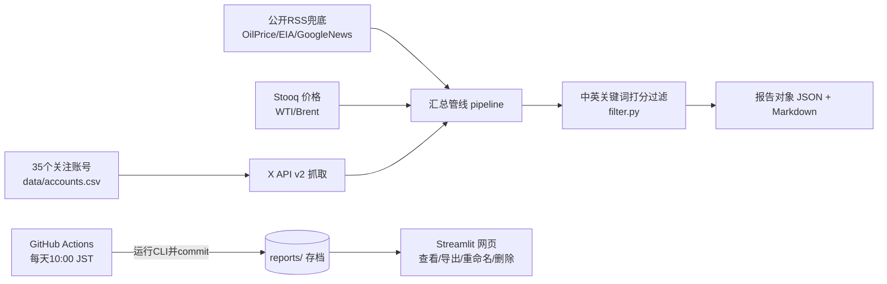

# 原油观察日报（oil-watch）

监控一批 X(Twitter) 账号，自动筛选其中与**原油价格及其影响因素**（供需、库存、需求、地缘制裁、油轮航运、宏观金融）相关的内容，每天 **10:00（日本时间）** 形成一份报告并长期存档；支持在网页端查看、**导出到本地、重命名、删除**。通过 GitHub 部署到 Streamlit Community Cloud。

## 架构与数据流



- **定时生成**：GitHub Actions（`.github/workflows/daily_report.yml`），cron `0 1 * * *` UTC = **10:00 JST**，生成后自动 commit 回仓库，因此报告长期不丢。
- **网页端**：Streamlit（`app.py`）读取 `reports/` 展示，并提供管理操作。
- **降级策略**：没有 X Token 时仍可用——自动改用免鉴权 RSS 信源出报告。

## 目录结构

```
oil-watch/
├── app.py                     # Streamlit 前端（部署入口）
├── requirements.txt
├── data/
│   └── accounts.csv           # 关注账号主清单（35个，源自截图整理）
├── oilwatch/                  # 核心包
│   ├── accounts.py            # 账号清单读取/新增
│   ├── keywords.py            # 中英双语关键词分组（可自行增删）
│   ├── filter.py              # 相关性打分
│   ├── prices.py              # WTI/Brent 价格快照（Stooq，免key）
│   ├── pipeline.py            # 编排
│   ├── report.py              # Markdown 渲染
│   ├── storage.py             # 存档/重命名/删除/导出ZIP
│   ├── cli.py                 # 命令行入口（Actions 调用）
│   └── sources/
│       ├── x_api.py           # X API v2
│       └── public_feeds.py    # RSS 兜底信源
├── reports/                   # 报告存档（.json + .md 成对）
├── .github/workflows/daily_report.yml
└── tests/
```

## 一、本地运行

```bash
cd oil-watch
python -m venv .venv && source .venv/bin/activate   # Windows: .venv\Scripts\activate
pip install -r requirements.txt

# 不配置 X Token 也能跑（只用公开信源）
python -m oilwatch.cli daily          # 生成日报到 reports/
python -m oilwatch.cli accounts       # 查看账号清单
python -m oilwatch.cli list           # 查看存档

streamlit run app.py                  # 打开网页
```

## 二、配置 X API（推荐，决定能否抓到账号推文）

1. 到 [X Developer Portal](https://developer.x.com/en/portal) 建 App，获取 **Bearer Token**（读取用户时间线需要 Basic 及以上付费套餐；免费套餐无此权限，此时程序自动降级为 RSS 信源，不会报错中断）。
2. 本地：在仓库根目录建 `.streamlit/secrets.toml` 或直接设环境变量：
   ```bash
   export X_BEARER_TOKEN="AAAAAAAAAAAAAAAAAAAA..."
   ```
3. GitHub：仓库 **Settings → Secrets and variables → Actions → New repository secret**，名称填 `X_BEARER_TOKEN`。
4. Streamlit Cloud：应用 **Settings → Secrets** 里填同一行：
   ```toml
   X_BEARER_TOKEN = "AAAAAAAAAAAAAAAAAAAA..."
   ```

## 三、部署到 GitHub + Streamlit（正式上线）

1. 在 GitHub 新建仓库（如 `oil-watch`），把本目录全部文件推上去：
   ```bash
   git init && git add . && git commit -m "init oil-watch"
   git branch -M main
   git remote add origin https://github.com/<你的用户名>/oil-watch.git
   git push -u origin main
   ```
2. 按上面第二节给仓库添加 `X_BEARER_TOKEN` Secret（可选）。
3. 到仓库 **Actions** 页，确认 workflow 已启用；可先点 **daily-oil-report → Run workflow** 手动跑一次，跑完 `reports/` 里会出现当天报告并被自动 commit。
4. 打开 [share.streamlit.io](https://share.streamlit.io/)，用 GitHub 登录 → **Deploy a public app**：选该仓库、分支 `main`、主文件 `app.py` → Deploy。
5. 之后每天 10:00（JST）Actions 自动出新报告；Streamlit 页面刷新即可看到。也可在网页左侧「立即生成报告」随时手动出一份。

> 时区由环境变量 `REPORT_TZ` 控制，默认 `Asia/Tokyo`。若要改成北京时间，把 workflow 与 Streamlit 里的 `REPORT_TZ` 改为 `Asia/Shanghai`，并把 cron 改为 `'0 2 * * *'`（北京10:00=UTC02:00）。

## 四、报告的查看、导出、重命名、删除

网页「🗄 报告档案」页：

- **导出到本地电脑**：单份可下载 `.md` / `.json` / `.zip`；顶部「一键导出全部存档（ZIP）」打包所有历史报告。
- **重命名**：输入新标题后确认，文件名与报告标题同步更新。
- **删除**：点删除后需二次确认（删除前建议先导出）。

### 关于持久化（重要，如实说明）

- GitHub Actions 每天把报告 **commit 进 Git 仓库**，这是权威长期存档，容器重建也不丢。
- Streamlit Community Cloud 的本地磁盘在应用重启/重新部署后会重置：在网页端做的**重命名/删除**作用于运行容器，若与 Git 中的副本不一致，重新部署后以 Git 版本为准。因此建议：改名/整理后用「导出全部 ZIP」在本地留一份；如需让删除永久生效，在本地仓库 `git rm reports/对应文件` 后推送即可。

## 五、自定义

- **增删账号**：直接编辑 `data/accounts.csv`（列：handle,display_name,category,priority,enabled,notes），或在网页「关注账号」页添加（写入 `data/accounts_local.csv`）。
- 账号清单共 35 个，全部启用；如需停用某个账号，把 `accounts.csv` 对应行 enabled 改为 0 即可。
- **关键词/阈值**：编辑 `oilwatch/keywords.py` 增删词组；阈值可在网页左侧滑块调整（核心油价词3分，供需/库存/需求/地缘/航运2分，宏观1分，默认≥3分入选）。
- **公开信源**：在 `oilwatch/sources/public_feeds.py` 的 `FEEDS` 中增删 RSS。

## 六、测试

```bash
python -m unittest discover -s tests -v
```

## 免责声明

本工具仅做信息聚合与研究辅助，不构成任何投资建议。抓取请遵守 X 及各信源的服务条款与速率限制。
